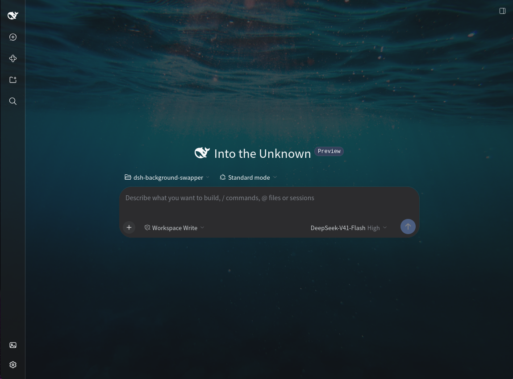
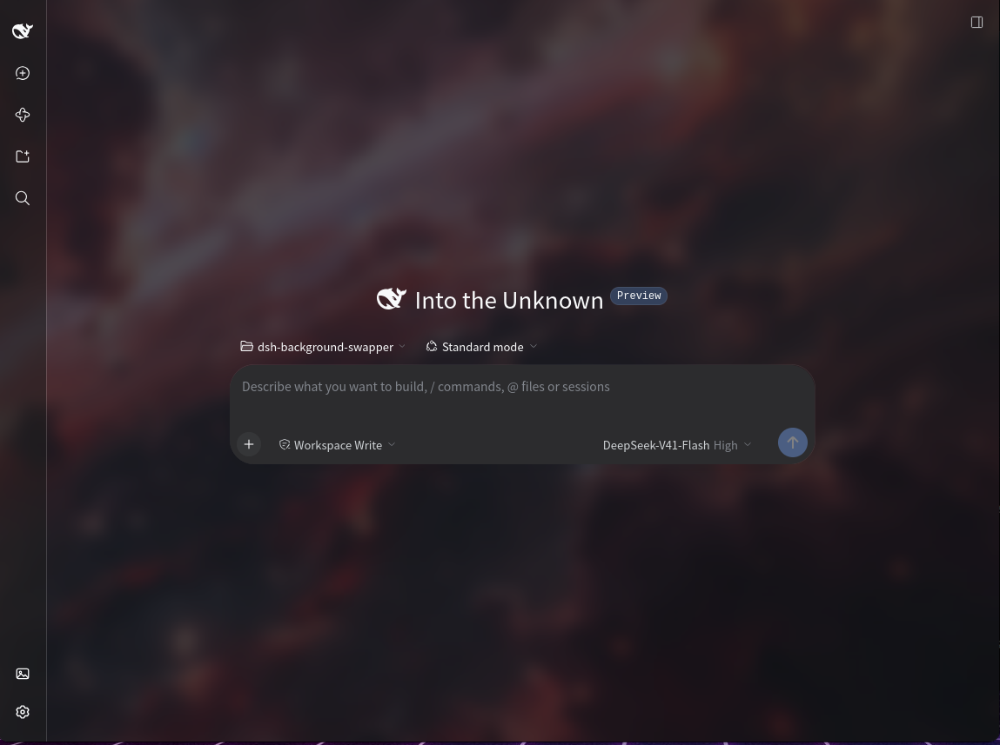
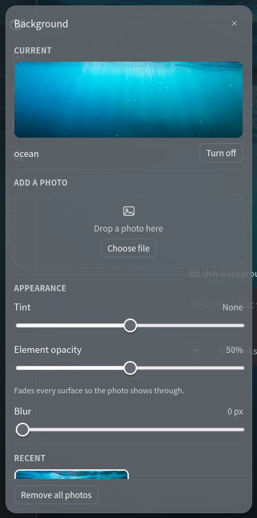

# Background Swapper

Put your own photo behind the DeepSeek Harness.

<p>
  
  
</p>

Two different backgrounds. The space photo on the right has **Blur** turned up.

**Swap Background** sits just above Settings in the left sidebar. Click it and a
small panel opens where you add a photo, give it a name, and keep a set of
favorites. Three presets set the balance between the interface and the photo in
one click, and four sliders fine-tune how the photo looks and how much of it
shows through.

## What you can do

- **Add a photo.** Drop one on the panel or pick a file, name it, and it becomes
  your background.
- **Keep a library.** Every saved photo is listed in **Recent**, newest first,
  six to a page. Click one to switch to it.
- **Rename or delete.** A pencil renames an entry, a bin deletes it, and
  **Remove all photos** empties the library.
- **Presets.** **Wallpaper**, **Glass** and **Solid** set both opacity sliders
  at once, and the one you are on stays lit. **Tint** and **Blur** are left
  alone, so trying a preset never undoes a photo you tuned.
- **Background opacity.** How solid the page behind everything is. Lower it and
  the photo fills the open space; at 0% the photo is bare. It starts at 20%.
- **Element opacity.** How solid the sidebar, cards and menus over that page are.
  Raise it to keep text readable while the photo stays bright behind them. It
  starts at 85%.
- **Tint.** One slider from *Darken 100%* to *Lighten 100%*, for when text is
  hard to read over a bright photo.
- **Blur.** Softens the photo, from 0 to 24 pixels.
- **Turn off.** Hides the photo and puts the interface back the way it was.
  Nothing is deleted.

## Install

You need the DeepSeek Harness, running either in a browser or in the desktop app.

1. In the Harness, open **Plugins** in the left sidebar.
2. Press **Install**.
3. Paste this repository's address:

   ```
   https://github.com/DevTarlow/dsh-background-swapper
   ```

4. Install it, then refresh the page.

If you would rather work from a local copy, clone the repository and paste the
folder's full path instead. The install dialog accepts a GitHub address, a
package name, or a local folder.

The plugin is added to your Harness, so it stays available in every session until
you remove it.

## Using it



1. Click **Swap Background** above Settings.
2. Under **Add a photo**, drop an image on the dashed box or press
   **Choose file**. A photo longer than 2560 pixels on a side is scaled down
   first, and the panel tells you when that happened.
3. Type a name and press **Save**. The photo is stored and becomes your
   background straight away.
4. Start from a preset in **Appearance** — **Wallpaper**, **Glass** or
   **Solid** — then adjust the sliders above the library. Everything applies as
   you drag and is saved a moment after you let go, so there is no Save button
   for any of it.
5. Click any thumbnail in **Recent** to switch photos. **Turn off** clears the
   current one without deleting it.

Press Escape or click anywhere outside the panel to close it.

## Your photos

Your photos live with the Harness, not inside the plugin:

```
~/.dsh/storages/background-swapper/
├── index.json      your names, the current photo, and the slider settings
└── images/         one file per photo
```

The Harness keeps its data in `~/.dsh` unless you have moved it. On Windows the
folder is `%USERPROFILE%\.dsh\storages\background-swapper`.

Because the photos are stored there, the same library and the same look appear
in every browser you open and in the desktop app, as long as they are pointed at
the same Harness.

To back your library up, copy that folder somewhere safe. To start over, delete
it: the plugin recreates it the next time it loads.

## Optional settings

These four values are read from [cordis.patch.yml](cordis.patch.yml) when the
plugin loads. Change one and restart the Harness.

| Setting | Default | What it does |
| --- | --- | --- |
| `pageSize` | `6` | How many photos show per page in **Recent**. |
| `maxImageBytes` | `16777216` (16 MB) | The largest photo that can be uploaded. |
| `maxDimension` | `2560` | The longest side a photo is scaled down to before it is saved. |
| `dataDir` | empty | Where the photos go. Empty means the folder shown above. |

If you would rather keep your own values, put the same override in your Harness
profile's patch file instead, so a later reinstall cannot replace it:

```yaml
- id: background-swapper
  config:
    pageSize: 9
    maxImageBytes: 33554432
```

A new install starts on the **Wallpaper** preset — **Background opacity** 20%,
**Element opacity** 85% — with **Tint** *None* and **Blur** off. The **Reset**
link beside each slider returns it to those values, which is the balance
**Wallpaper** sets.

## Common questions

**The photo is too faint, or too strong.** Use **Background opacity**. Lower
shows more photo in the open page, higher makes that page more solid. At 100% the
photo only shows through the panels; with **Element opacity** at 100% as well
nothing shows at all, and the panel says so.

**The interface is too see-through to read.** Raise **Element opacity**. That
solidifies the sidebar, cards and menus without taking the photo off the page, so
you no longer have to choose between the two. The sliders fade different layers:
**Background opacity** the page everything sits on, **Element opacity** what sits
on it.

**Text is hard to read over the photo.** Set **Tint** to darken it, or **Blur** to
soften it. Both keep the effect; raising **Element opacity** only hides more of
the photo behind the panels.

**What do the presets change?** Only the two opacity sliders. **Tint** and
**Blur** stay exactly where you left them, so trying a preset never undoes a
tuned photo. **Solid** keeps the photo selected but hides it behind a fully
opaque interface; **Turn off** clears the photo instead. Both leave it in
**Recent**, and one click brings it back.

**Why is the sidebar darker than the rest?** Two see-through surfaces sit behind
the sidebar and only one behind the main area, so at the same slider setting the
sidebar always looks a little more solid.

**Does it work in another browser?** Yes. The library and the settings are stored
with the Harness, so any browser pointed at it sees the same thing.

**Can each session have its own background?** No. One background applies to the
whole app.

**What image types can I use?** PNG, JPEG, WebP, GIF and AVIF. Animated GIFs keep
animating. SVG files are refused.

**My photo looks different after uploading.** Anything longer than 2560 pixels on
a side is scaled down before it is saved, and a scaled photo is re-encoded, which
drops camera metadata such as the date and location. Animated GIFs are never
scaled.

## Removing it

Open **Plugins**, find **dsh-background-swapper**, and uninstall it. The interface
goes back to normal immediately. Your photos stay in the folder above, so delete
that folder yourself if you also want the disk space back.

## For developers

Two files plus a storage helper, and no build step.

| File | Runs in | Owns |
| --- | --- | --- |
| [index.js](index.js) | the Harness | `apply(ctx, config)` and the `/__background-swapper` routes |
| [store.js](store.js) | the Harness | `index.json` and `images/` on disk |
| [client.js](client.js) | the browser | the background painter and the sidebar panel |

Things to know before changing it:

- **It imports nothing it is not given.** The Harness side uses only Node
  built-ins and the browser side only React, which the Web shell already
  provides. That is what lets it load on a released `dsh` with no build.
- **The photo is painted on `html::before`**, a fixed pseudo-element behind
  everything, so the application's own elements are left alone.
- **The see-through effect redefines the theme's background variables**, using
  `color-mix()` of the same palette tones they already point to. The aliases are
  split into the ground the frame and body paint and the panels raised over it,
  and each slider fades one group. No application class name is targeted, so
  renaming one breaks nothing.
- **Everything the plugin adds is React-rendered**, so unloading it restores the
  interface exactly. Nothing writes to `document.body` or appends a stylesheet
  by hand.
- **Uploads are validated and ids are looked up in the index**, so a request can
  never name a path on disk. `maxImageBytes` is enforced on the Harness side and
  `maxDimension` in the browser.
- **The slider defaults live in one place**, `DEFAULT_SETTINGS` in
  [store.js](store.js), and are served with every `GET /list` so the panel's
  Reset links cannot drift away from them. The panel's **Wallpaper** preset
  repeats those same numbers, so a fresh library and a Reset both light it up:
  change one and the other belongs in the same commit.

```sh
npm test
```

Both harnesses run in under a second and need no browser.
[test/host.test.mjs](test/host.test.mjs) mounts the routes on a bare `node:http`
server and drives the whole surface over real HTTP.
[test/client.test.mjs](test/client.test.mjs) loads the browser bundle against a
stub module loader and checks the registrations, the exact CSS the painter
emits, and the preset row the panel renders.

Edit `client.js` and refresh the page. Edit `index.js`, `store.js` or
`cordis.patch.yml` and restart the Harness. [AGENTS.md](AGENTS.md) has the full
loop.

## License

[MIT](LICENSE).
